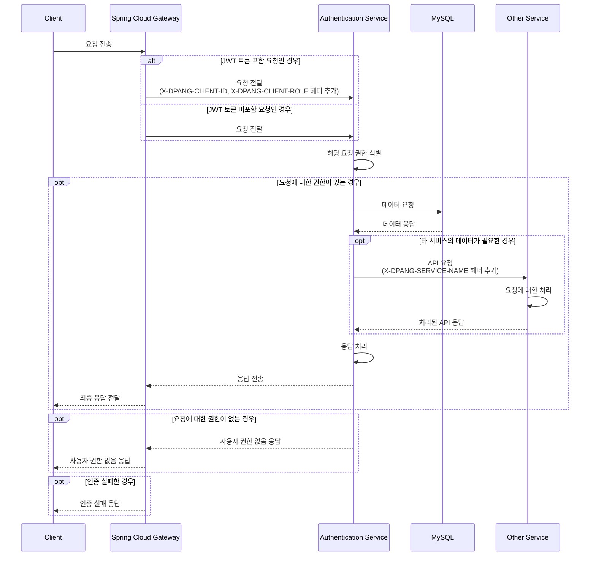
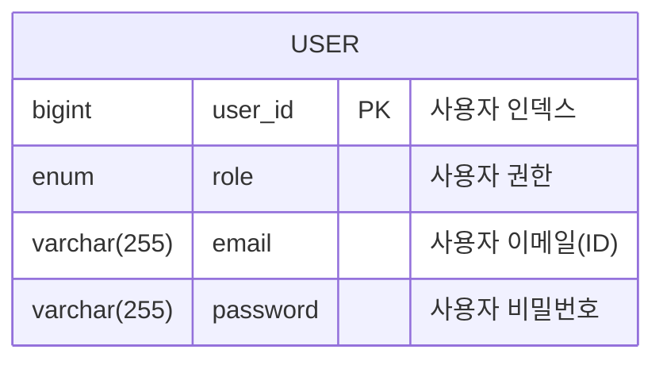

# DPANG AUTH SERVER

## 🌐 프로젝트 개요

이 프로젝트는 인증 서비스를 지원하는 마이크로서비스로서, 사용자의 회원가입, 로그인 등 인증 관련 기능을 제공합니다.

이를 통해 사용자의 인증 관련 작업을 효율적으로 관리하고, 사용자 경험을 향상시키는데 중점을 두고 있습니다.

## 🔀 프로젝트 아키텍처

아래의 시퀀스 다이어그램은 본 프로젝트의 주요 컴포넌트인 Spring Cloud Gateway, 인증 서비스, 그리고 타 서비스 간의 상호작용을 보여줍니다.



이 시퀀스 다이어그램을 통해 볼 수 있듯이, 모든 클라이언트 요청은 먼저 Spring Cloud Gateway를 통해 전달됩니다.

만약 클라이언트 요청에 JWT 토큰이 포함되어 있다면, Gateway는 해당 토큰을 분석하여 사용자의 ID와 Role 정보를 추출하여 
'X-DPANG-CLIENT-ID'와 'X-DPANG-CLIENT-ROLE'이라는 사용자 정의 헤더에 추가하여 인증 서비스에 전달합니다.

인증 서비스는 해당 요청에 대한 권한을 식별하고, 권한이 있는 경우에만 요청을 처리합니다.

권한이 있는 경우, 인증 서비스는 MySQL 데이터베이스에서 필요한 데이터를 요청하고, 그 데이터를 다시 클라이언트에게 반환합니다.

만약 해당 요청에 대한 데이터가 다른 서비스에서 필요한 경우, 인증 서비스는 해당 서비스에 API 요청을 전달하고, 그 처리 결과를 다시 클라이언트에게 반환합니다.

만약 해당 요청에 대한 권한이 없는 경우, 인증 서비스는 클라이언트에게 '사용자 권한 없음' 응답을 반환하며

해당 요청에 대한 인증이 실패한 경우, Gateway는 클라이언트에게 '인증 실패' 응답을 반환합니다.

## 🗃️ 데이터베이스 구조

### MYSQL 데이터베이스 구조

인증 서비스에서는 사용자의 정보를 관리하기 위해 MySQL 데이터베이스를 사용하고 있습니다.

데이터베이스에 저장되는 테이블은 'USER'라는 이름을 가지며, 다음과 같은 필드를 가집니다:



### Redis 데이터베이스 구조

인증 서비스에서는 사용자의 리프레쉬 토큰과 이메일 검증 코드를 관리하기 위해 Redis를 사용하고 있습니다.

Redis에 저장되는 데이터는 'RefreshToken'과 'VerificationCode'라는 이름의 해시 데이터 구조로 저장됩니다.

1. **RefreshToken 해시**: `RefreshToken:<사용자 ID>` 형태의 키를 가지며, 해시의 value는 `{ "id": <사용자 ID>, "refreshToken": <리프레쉬 토큰> }` 형태로 저장됩니다.
    - `id`: 사용자의 ID. 사용자를 유일하게 식별하는 값입니다.
    - `refreshToken`: 사용자의 리프레쉬 토큰 값.

   이 해시는 생성된 지 5일이 지나면 Redis에서 자동으로 삭제됩니다. 이는 리프레쉬 토큰의 유효 기간을 관리하기 위한 것입니다.


2. **VerificationCode 해시**: `VerificationCode:<사용자 이메일>` 형태의 키를 가지며, 해시의 value는 `{ "email": <사용자 이메일>, "code": <인증 코드> }` 형태로 저장됩니다.
    - `email`: 사용자의 이메일. 사용자를 유일하게 식별하는 값입니다.
    - `code`: 사용자 인증 번호.

   이 해시는 생성된 지 5분이 지나면 Redis에서 자동으로 삭제됩니다. 이는 이메일 인증 코드의 유효 기간을 관리하기 위한 것입니다.

## ✅ 프로젝트 실행

해당 프로젝트를 추가로 개발 혹은 실행시켜보고 싶으신 경우 아래의 절차에 따라 진행해주세요

#### 1. `secret.yml` 생성

```commandline
cd ./src/main/resources
touch secret.yml
```

#### 2. `secret.yml` 작성

```yaml
spring:
  datasource:
    driver-class-name: com.mysql.cj.jdbc.Driver
    url: jdbc:mysql://{YOUR_DB_HOST}:{YOUR_DB_PORT}/{YOUR_DB_NAME}
    username: { YOUR_DB_USERNAME }
    password: { YOUR_DB_PASSWORD }

  data:
    redis:
      cluster:
        nodes: { YOUR_REDIS_CLUSTER_NODES }

  application:
    name: auth-server

eureka:
  instance:
    prefer-ip-address: true

  client:
    register-with-eureka: true
    fetch-registry: true
    service-url:
      defaultZone: http://{YOUR_EUREKA_SERVER_IP}:{YOUR_EUREKA_SERVER_PORT}/eureka/

jwt:
  secret-key: { YOUR_SECRET_KEY }
```

#### 3. 프로젝트 실행

```commandline
./gradlew bootrun
```

**참고) 프로젝트가 실행 중인 환경에서 아래 URL을 통해 API 명세서를 확인할 수 있습니다**

```commandline
http://localhost:8080/swagger-ui/index.html
```